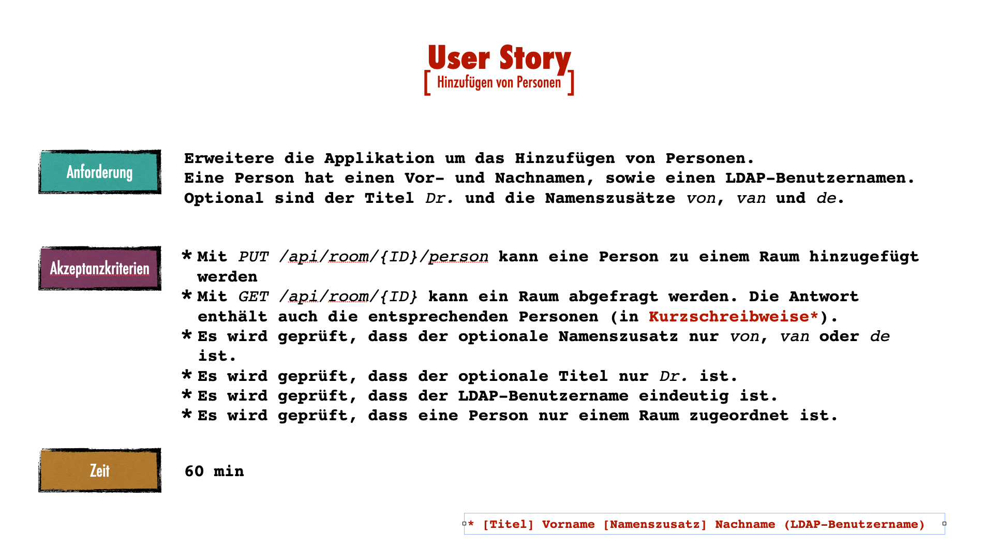

# Workshop `implementing DDD with hexagonal architecture`

[](https://github.com/larmic/workshop_ddd_implementing_hexagonal_architecture/actions/workflows/project_setup.yml)
[](https://github.com/larmic/workshop_ddd_implementing_hexagonal_architecture/actions/workflows/story_1.yml)
[](https://github.com/larmic/workshop_ddd_implementing_hexagonal_architecture/actions/workflows/story_2.yml)
[](https://github.com/larmic/workshop_ddd_implementing_hexagonal_architecture/actions/workflows/story_3.yml)
[](https://github.com/larmic/workshop_ddd_implementing_hexagonal_architecture/actions/workflows/story_4.yml)

Dieses Projekt dient als Unterstützung und Musterlösung zu meinem [Workshop](misc/presentation/workshop_folien.pdf). 
In den einzelnen Branches sind die jeweiligen Umsetzungen zu den User Stories des Workshops dokumentiert. 
Hier im `main` befindet sich das erste Projektsetup.

#### Stories und Branches
* :100: [Projektsetup](misc/stories/projekt_setup.png) Branch: ```main```
* :100: [Erfassen von Räumen](misc/stories/story1_erfassen_von_raeumen.png) Branch: `story1_anlegen_von_räumen`
* :100: [Hinzufügen von Personen](misc/stories/story2_hinzufuegen_von_personen.png) Branch: `story2_hinzufügen_von_personen`
* :boom: [Person in mehreren Räumen](misc/stories/story3_mehrere_raeume.png) Branch: `story3_person_in_mehreren_räumen`
* :boom: [Events](misc/stories/story4_events.png) Branch: `story4_events`

:100: - Fertig

:boom: - In Arbeit oder noch nicht begonnen

#### Story in diesem Branch ```story2_hinzufügen_von_personen```



## Requirements

* Java 17
* Docker

## Build and run

Siehe [Makefile](Makefile) und [requests.http](misc/requests.rest) 
([Jetbrains HTTP Client](https://www.jetbrains.com/help/idea/http-client-in-product-code-editor.html)) für genauere 
Informationen.

```shell
# java 
$ make java/test
$ make java/build
$ make java/run

# docker
$ make docker/build
$ make docker/run
```