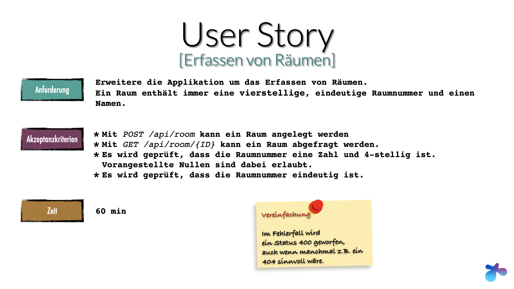

# Workshop `implementing DDD with hexagonal architecture`

[](https://github.com/larmic/workshop_ddd_implementing_hexagonal_architecture/actions/workflows/project_setup.yml)
[](https://github.com/larmic/workshop_ddd_implementing_hexagonal_architecture/actions/workflows/story_1.yml)
[](https://github.com/larmic/workshop_ddd_implementing_hexagonal_architecture/actions/workflows/story_2.yml)
[](https://github.com/larmic/workshop_ddd_implementing_hexagonal_architecture/actions/workflows/story_3.yml)
[](https://github.com/larmic/workshop_ddd_implementing_hexagonal_architecture/actions/workflows/story_4.yml)

Dieses Projekt dient als Unterstützung und Musterlösung zu meinem [Workshop](https://larmic.de/workshops/ddd_hexagonal_architecture_for_devs/). 
In den einzelnen Branches sind die jeweiligen Umsetzungen zu den User Stories des Workshops dokumentiert. 

#### Stories und Branches
* :100: [Projektsetup](misc/stories/projekt_setup.png) Branch: ```main```
* :100: [Erfassen von Räumen](misc/stories/story1_erfassen_von_raeumen.png) Branch: `story1_anlegen_von_räumen`
* :100: [Hinzufügen von Personen](misc/stories/story2_hinzufuegen_von_personen.png) Branch: `story2_hinzufügen_von_personen`
* :100: [Person in mehreren Räumen](misc/stories/story3_mehrere_raeume.png) Branch: `story3_person_in_mehreren_räumen`
* :100: [Events](misc/stories/story4_events.png) Branch: `story4_events`

#### Story in diesem Branch ```story1_anlegen_von_räumen```



## Requirements

* Java 21
* Docker

## Build and run

Siehe [Makefile](Makefile) und [requests.http](misc/rest-requests/requests.http) 
([Jetbrains HTTP Client](https://www.jetbrains.com/help/idea/http-client-in-product-code-editor.html)) für genauere 
Informationen.

```shell
$ make 
```