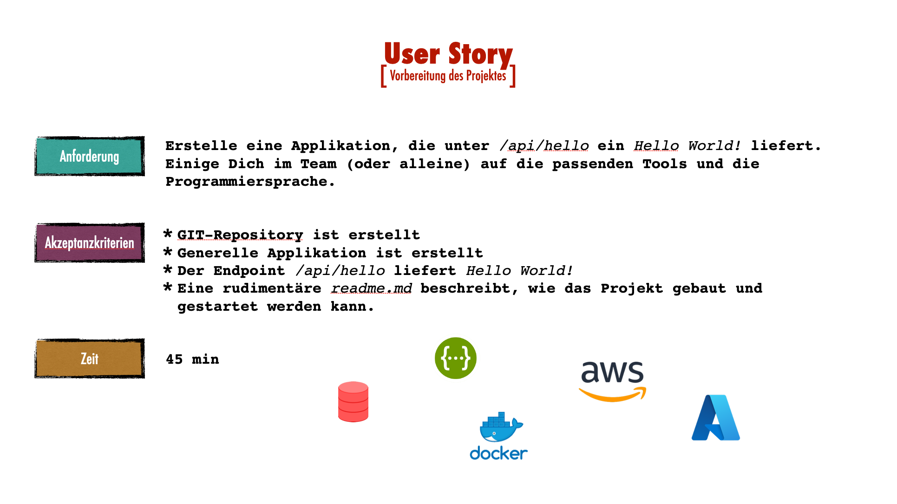

# Musterlösung zum Workshop `implementing DDD with hexagonal architecture`

[](https://github.com/larmic/workshop_ddd_implementing_hexagonal_architecture/actions/workflows/story1.yml)
[](https://github.com/larmic/workshop_ddd_implementing_hexagonal_architecture/actions/workflows/story2.yml)
[](https://opensource.org/licenses/Apache-2.0)

Dieses Projekt dient als Unterstützung und Musterlösung zu meinem [Workshop](misc/presentation/workshop_folien.pdf). 
In den einzelnen Branches sind die jeweiligen Umsetzungen zu den User Stories des Workshops dokumentiert. 
Hier im `main` befindet sich das erste Projektsetup.

#### Stories und Branches
* Projektsetup: ```main```
* Erfassen von Räumen: `story1_anlegen_von_räumen`

#### Story in diesem Branch



## Requirements

* Java 17
* Maven >= 3.6.x
* Docker optional

## Build and run

Siehe [Makefile](Makefile) für genauere Informationen.

```shell
# java 
$ make java/build
$ make java/run
$ make http-call

# docker
$ make docker/build
$ make docker/run
$ make http-call
```